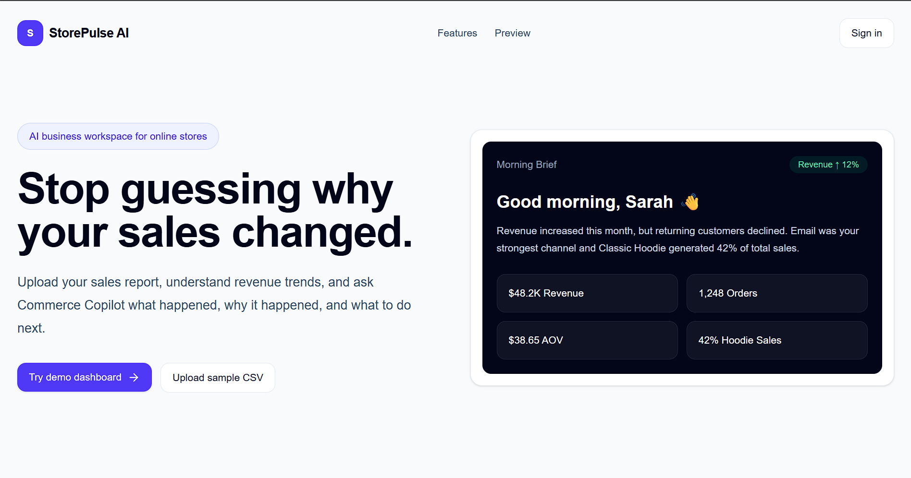
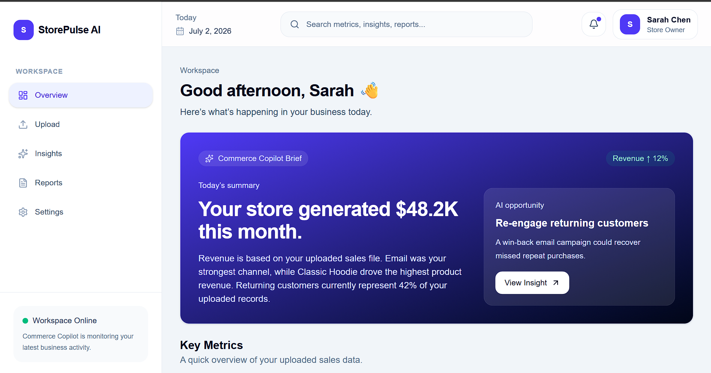
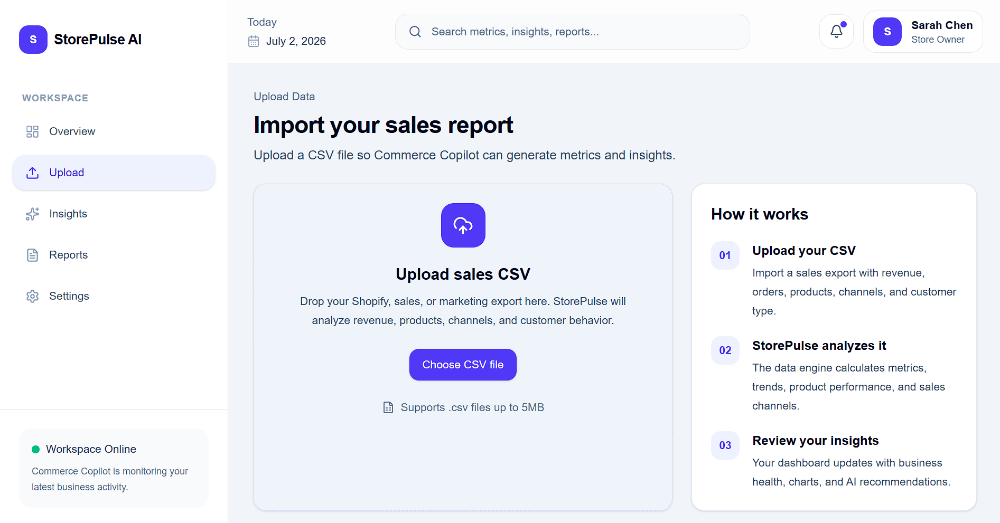
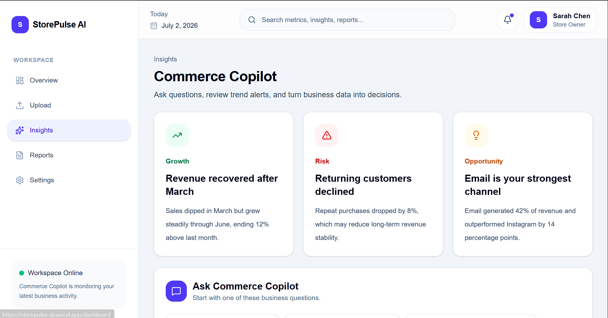
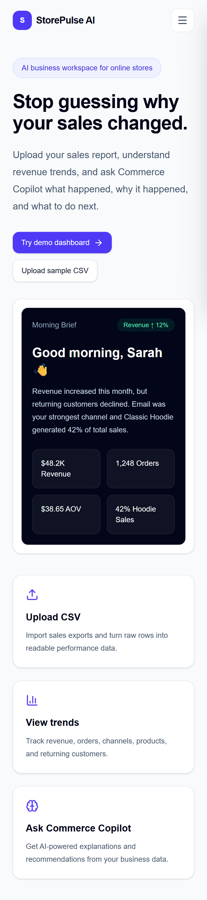
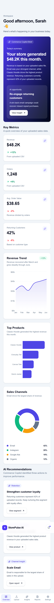

# StorePulse AI

AI-powered ecommerce analytics dashboard that transforms raw sales CSV exports into actionable business insights.


---

## Live Demo

🔗 **Live Website**

https://storepulse-ai.vercel.app/

---

## Overview

StorePulse AI helps ecommerce business owners understand their sales performance without needing spreadsheets or complex analytics tools.

Users can upload a CSV export and instantly explore:

- Revenue trends
- Sales performance
- Product insights
- Sales channels
- AI-generated recommendations

The project demonstrates the complete product design process from UX thinking through responsive frontend implementation.

---
## Product Screens

### Landing Page



### Analytics Workspace



### CSV Upload Flow



### Commerce Copilot



### Responsive Experience

<p>
  
  
</p>

---

## Features

### Landing Page

- Responsive SaaS landing page
- Mobile navigation drawer
- Hero dashboard preview
- Feature highlights

### Authentication

- Login UI
- Signup UI
- Responsive layouts

### Dashboard

- KPI overview
- Revenue trends
- Product performance
- Sales channel breakdown
- AI recommendations

### CSV Upload

- CSV validation
- Column checking
- Upload feedback
- Dynamic metrics generation

### Insights

- Business opportunities
- Risks
- Growth suggestions

### Reports

- Report overview
- Export-ready layouts

### Settings

- Workspace preferences
- Account settings
- Notification controls

---

## Tech Stack

- Next.js 16
- React
- TypeScript
- Tailwind CSS
- Recharts
- Papa Parse
- Lucide Icons

---

## Responsive Design

Designed for:

- Desktop
- Tablet
- Mobile

---

## Accessibility

- Semantic HTML
- Keyboard-friendly navigation
- Responsive typography
- High color contrast
- Clear visual hierarchy

---

## Project Structure

```
app/
components/
lib/
types/
public/
```

---

## Future Improvements

- Supabase Authentication
- Cloud database
- AI chat assistant
- Report exporting
- Team collaboration
- Live ecommerce integrations
- Dark mode

---

## Author

Designed and developed by

**Dara**

GitHub:
https://github.com/Daradesignss